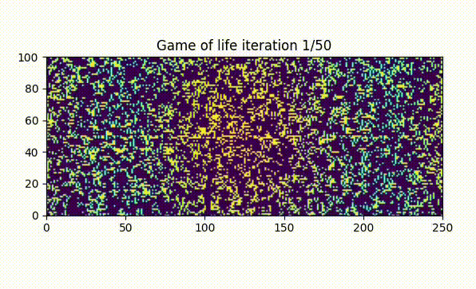

# Game of Life Simulation on MPI Grid

The Game of Life, also known simply as Life, is a fascinating cellular automaton devised by the British mathematician John Horton Conway in 1970. Unlike typical computer games, it’s a zero-player game, meaning its evolution is determined solely by its initial state, requiring no further input. Let me delve into the intriguing details:

## What Is Conway’s Game of Life?

The Game of Life is not your ordinary video game. It operates as a cellular automaton, a grid of cells that can live, die, or multiply based on a few simple mathematical rules.

John Conway introduced this game, and it gained widespread recognition after being featured in a Scientific American article in 1970.

The game consists of a grid where each cell can be alive or dead. These cells evolve according to specific rules.

### Rules of the Game:

For a space that is populated:
- Each cell with one or no neighbors dies, as if by solitude.
- Each cell with four or more neighbors dies, as if by overpopulation.
- Each cell with two or three neighbors survives.
- Each cell with three neighbors becomes populated.

## Patterns and Evolution:

Depending on the initial conditions, the cells form various intricate patterns throughout the course of the game.

These patterns can include oscillators, gliders, and even structures that seem to move indefinitely.

The Game of Life has captured the imagination of mathematicians, computer scientists, and enthusiasts alike.

## What I've implemented:

Implemented Conway's Game of Life on a distributed 2D grid topology using MPI_Cart_create.

Each process manages a sub-section of the grid, calculating the next state of cells based on the current state's rules.

Used MPI_Cart_shift to exchange boundary information with neighboring processes to accurately compute the state transitions at the edges.

## Demo

Here is a short demo of the game.



## Requirements
- Linux or Mac OS
- Python 3
- Pip

## Installation
- First of all you need to install mpich on your system. mpi4py was a python library used, and relies on OpenMPI, which you can install by installing mpich
    - To install on Linux
    ```sh
    sudo apt install mpich
    ```
    - To install on MacOS
    ```sh
    brew install mpich
    ```
- Clone the project

```sh
git clone
```
- Now you can install the requirements of the Python project.
    - First of all you need to create a virtual envionment
     ```sh
    python3 -m venv mpi_env/
    ```
    - Now activate the virtual environment
    ```sh
    source mpi_env/bin/activate
    ```
    - And then install the requiremnts
    ```sh
    pip install -r requirements.txt
    ```
## Usage

Run the project
```sh
mpiexec -n 6 python3 mpi_grid_game_of_life.py
```
Feel free to custumize the number of processes.